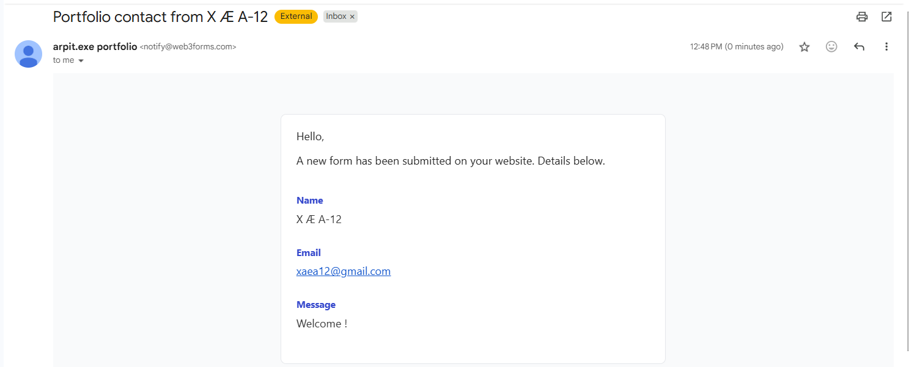

# arpit.exe - my playable developer portfolio

> A portfolio that behaves like a little terminal game. You don't *scroll* it - you *play* it.
> Type commands like `visit projects` or `run portfolio()` to unlock each section.

Hi, I'm **Arpit** - a Computer Science undergrad at **IIT Jodhpur**. I got tired of the usual
scroll-down-and-skim portfolio, so I built one that's actually fun to poke at: a terminal sits
front and center, and visitors unlock my projects, skills, education and more by typing commands
(or by letting the built-in AI guide walk them through it). It's playful on the surface, but
underneath it's still a serious, recruiter-friendly portfolio - everything important is one
command away.

🔗 **Live demo:** https://my-profile-phi-vert.vercel.app/ · 💻 **Best on desktop**, fully responsive on mobile.

---

## Why I built it this way

Most portfolios say "here's what I can do." I wanted mine to *show* it. The whole experience is a
small product in itself - a command parser, a fuzzy matcher that forgives typos, a tiny in-browser
"AI" that understands what you're looking for, a level/XP system, and a pile of motion design - all
wired together with clean, reusable components. If you're a recruiter, you can skip the game and
just type `run portfolio()` to reveal everything at once.

## What's inside

- **A real terminal.** Type commands to unlock sections. It autocompletes (`Tab`), remembers
  history (`↑`/`↓`), tolerates typos with "did you mean…?", and answers back with a bit of wit.
- **An AI guide (no API key needed).** Ask it things like *"best project for a backend role?"* or
  *"what is Arpit best at?"* and it replies **and** opens the right section. It's a deterministic
  intent engine today, but it's structured so a real LLM can drop straight into one function.
- **Ten unlockable sections**- About, Skills, Education (with JEE ranks + skills derived from my
  coursework), a Toolbox of things I've actually worked with, Projects, Experience, Achievements,
  Contact, Resume, and an AI Playground.
- **Hover-to-preview projects.** Hovering a featured project floats a little app-window mock that
  follows your cursor -plus 3D tilt cards and magnetic buttons.
- **Game feel.** XP, levels, badges, a quest log, achievement toasts, and a progress bar. Your
  progress is saved locally, so it remembers you on the next visit.
- **Easter eggs.** A few secret commands and the Konami code are hidden in there. Curiosity is
  rewarded. 
- **Considered details.** Glassmorphism, a particle field, a cursor aura, four switchable themes,
  reduced-motion and keyboard-navigation support, SEO meta, and a `<noscript>` fallback.

## The projects it showcases

| Project | What it is | Tech |
| ------- | ---------- | ---- |
| **Vamos** | Real-time ride-pooling for campuses & tech parks | Next.js, Supabase, PostgreSQL, WebSockets |
| **Orbit** | A productivity dashboard (tasks · habits · time-blocks) | React 18, Vite, Vanilla CSS |
| **Movie Recommendation System** | Hybrid recommender (collaborative + content + SVD) | Python, scikit-learn, Streamlit |
| **Smart Route Planner** | Dijkstra shortest-path over a city graph | C++ |

---

## Tech stack

**React 19 · TypeScript · Vite · Tailwind CSS v4 · Framer Motion · Zustand · Web3Forms**

It's a fast static site (no server to maintain) that deploys anywhere — I host it on Vercel.
The one "backend-ish" piece is the contact form, which delivers messages straight to my inbox
via Web3Forms (see below).

## 📬 Working contact form — real email delivery

The contact form isn't a fake demo — it actually **delivers messages to my inbox in real time**.
On submit it POSTs to the [Web3Forms](https://web3forms.com) API (with an SMTP-style `mailto`
fallback if the network hiccups), so a static site with no server of its own can still send email.

Here's an actual submission landing in my inbox:



> Under the hood: a `fetch` POST to Web3Forms with proper `sending / sent / error` states, form
> reset on success, and a graceful mail-app fallback. Implementation lives in
> [`src/components/sections/Contact.tsx`](src/components/sections/Contact.tsx).

## Run it locally

```bash
git clone <your-repo-url>
cd <repo-folder>
npm install
npm run dev      # http://localhost:5173
```

Other scripts:

```bash
npm run build    # type-check + production build → /dist
npm run preview  # preview the production build
npm run lint     # oxlint
```

## How to play (the commands)

| Command | What it does |
| ------- | ------------ |
| `help` | List every command |
| `decode about` | About me |
| `show skills` | Skill tree |
| `load education` | Education, ranks & coursework |
| `open toolbox` | Tools & platforms I've worked with |
| `visit projects` | Project build log (hover to preview!) |
| `trace experience` | Work timeline |
| `unlock achievements` | Achievements, stats & leadership |
| `contact me` | Get in touch |
| `open resume` | View / download my resume |
| `enter ai` | The AI playground |
| `run portfolio()` | Unlock everything at once |
| `ask <question>` | Talk to the AI guide |

---

## Want to use this as a template?

Everything you'd change lives in **one file**: [`src/data/portfolio.ts`](src/data/portfolio.ts).
Update the `profile`, `skills`, `projects`, `experience`, `education`, `toolbox`, `achievements`,
and `leadership` objects and the whole site - including the AI guide and the generated resume -
updates itself. A quick tour of the rest:

```
src/
├─ data/         # all content (portfolio, sections, badges) — start here
├─ store/        # Zustand game state (unlocks, XP, badges, theme) + local persistence
├─ lib/          # command parser, AI engine, fuzzy matching, resume generator
├─ components/
│  ├─ effects/   # animated background, particles, cursor aura
│  ├─ ui/        # reusable bits (glass cards, buttons, tilt, counters, typewriter…)
│  ├─ terminal/  # the command terminal
│  ├─ mission/   # the quest log / HUD panel
│  ├─ sections/  # each unlockable section
│  └─ system/    # boot screen, toasts, AI assistant
└─ App.tsx       # layout, theming, deep-linking, scroll
```

Other knobs: commands & sections in `src/data/sections.ts`, AI behaviour in `src/lib/ai.ts`
(`generateReply()` is the single hook to swap in a real LLM), and themes/design tokens in
`src/index.css`.

---

## A note on accessibility

It's playful, but it's built to be usable: full keyboard support in the terminal, a skip link,
focus-visible styles, ARIA labels, and a `prefers-reduced-motion` path that calms the animations
right down. There's also a plain-text fallback for anyone with JavaScript disabled.

---

## 🕹️ Secret commands & easter eggs

The terminal hides a few things for the curious. Type any of these into the on-page shell:

| Command | What happens |
| --- | --- |
| `matrix` | Wake up, Neo… |
| `sudo` | Nice try - you're not root (yet). |
| `sudo make me a sandwich` | 🥪 |
| `coffee` | HTTP 418: I'm a teapot. Coffee denied. |
| `hack` | "Elite" hacking sequence, declassified. |
| `vim` | You can check out any time you like… |
| `rm -rf /` | Relax - the portfolio is read-only. |
| `42` | The Answer to Life, the Universe, and Everything. |
| `exit` | There is no exit. Only more portfolio. |
| `ping` | pong. |

Other hidden things to find:

- **The Konami code** - `↑ ↑ ↓ ↓ ← → ← → B A` switches the theme and unlocks a badge. 🎮
- **Inspect source** - open your browser's DevTools console for a hidden message.
- **Fun toggles** - `theme` cycles the colour scheme (Aurora / Synthwave / Matrix / Solar), and `crt` adds retro scanlines.
- **Handy commands** - `run portfolio()` unlocks everything at once, `inspect stack` gives a quick tech rundown, `whoami`, `ls`, `progress`, and `reset` all do what you'd expect.
- **Badges** - discovering a secret earns the **Curious Hacker** badge; exploring sections, levelling up, and chatting with the AI guide earn others (see the bottom of *Mission Control*).

> Tip: type `ask <anything>` to talk to the in-browser AI guide - e.g. `ask best project for backend`.

---

Built with a lot of coffee and a slightly unreasonable amount of motion design (and ofcourse AI). If you made it this
far- try the Konami code. 🎮
